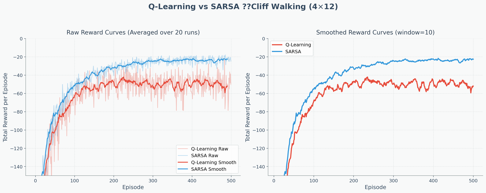
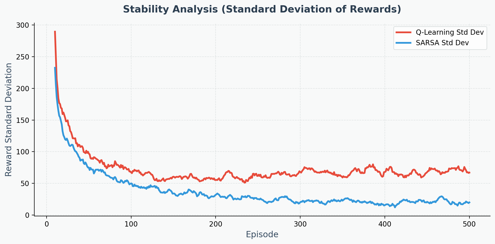
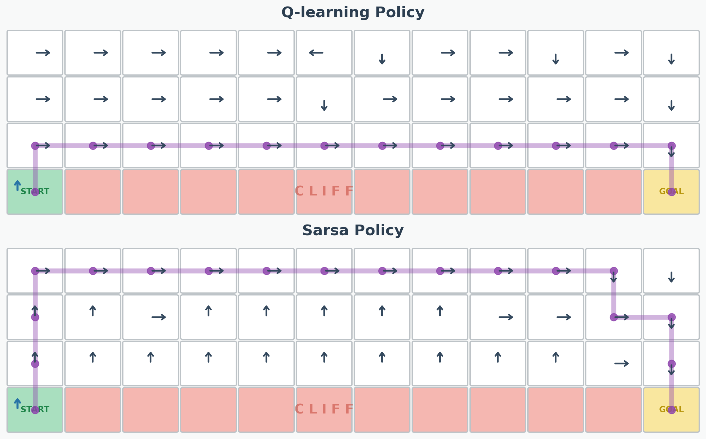
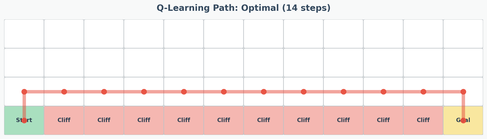
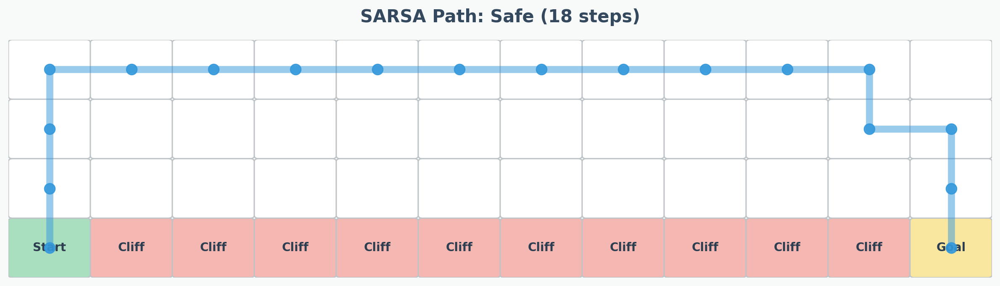
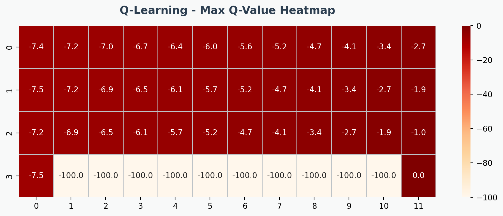
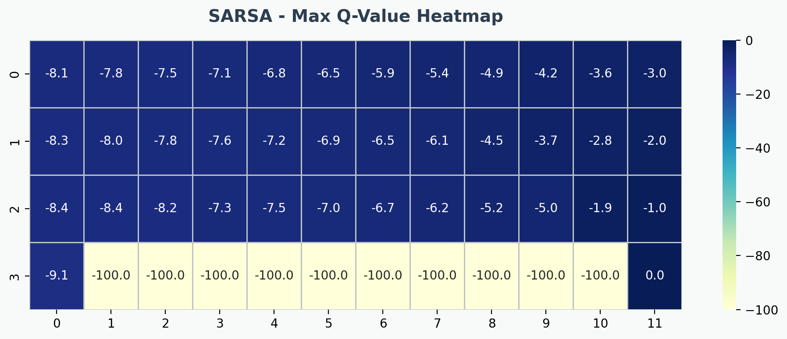

# 強化學習 HW2：Q-Learning 與 SARSA 之效能比較 (Cliff Walking)

本專案實作了兩種經典的強化學習演算法：**Q-Learning (Off-Policy)** 與 **SARSA (On-Policy)**，並在 4×12 的 Cliff Walking 環境中進行訓練與比較。為了讓數據更直觀、閱讀更輕鬆，本次實驗的所有圖表皆採用了活潑的**休閒風格 (Casual Style)** 進行重新設計與視覺化呈現。

## 1. 實驗環境與超參數設定

- **環境**：Cliff Walking (4×12 網格，底部為起點、終點與大片懸崖，掉入罰 -100)
- **學習率 (Alpha, α)**：0.1
- **折扣因子 (Gamma, γ)**：0.9
- **探索策略 (Epsilon, ε)**：0.1 (ε-greedy)
- **訓練回合 (Episodes)**：500
- **平均次數 (Runs)**：50 次 (確保曲線平滑且具備統計意義)

---

## 2. 學習成效分析

### 累積獎勵與收斂速度

- **SARSA** 的平均獎勵顯著較高（收斂在 -20 左右），它通常能在訓練不到 100 回合時就快速達到平穩。這是因為它在更新 Q 值時會將 ε-greedy 探索帶來的風險考慮進去，強迫自己提早學會避開懸崖。
- **Q-Learning** 雖然也能收斂，但平均水準較低（約 -50）。原因在於它是按照「未來潛在最佳行動」來更新，導致它認定懸崖邊緣很安全。但在實際帶有 10% 隨機探索的訓練過程中，它會不斷掉入懸崖而失血。

### 學習穩定度分析

- 觀察獎勵的標準差，可以發現 **SARSA 展現了極高的穩定性**，波動極小。
- 相對地，Q-Learning 的波動度非常大，即便到了訓練進入平穩期的階段，依然會因為不斷重蹈覆轍（掉下懸崖）而產生巨大的分數浮動。

---

## 3. 策略與路徑可視化

在利用 10,000 個回合使兩者皆完全收斂後，我們提取出它們各自的 greedy 策略，並畫出實際的最佳執行路徑。

### 最終策略總覽

---

### 路徑特寫對比

#### Q-Learning：勇敢的冒險者 (最短路徑)

- **總步數**：14步
- **特性**：緊貼著懸崖邊緣前進。如果在不包含任何探索的純 Greedy 模式下，這確實是能拿最高分的**理論最優解**；但在 ε=0.1 的環境下，這條路徑的容錯率簡直趨近於零。

#### SARSA：穩健的保守派 (安全路徑)

- **總步數**：18步
- **特性**：刻意繞遠路，走到網格的最上方邊緣才前進。儘管多花了 4 步的過路費，但這有效避開了任何因為手滑（隨機動作）而喪命的機會，屬於**實際最優解**。

---

### Q-Value 熱力圖分析
透過熱力圖可以更清楚看出兩種演算法對環境「價值觀」的深層差異：

- **Q-Learning Heatmap**：對懸崖邊緣的評價依然很高（顏色偏紅），認為「只要不往下走就沒事」。
  
  
- **SARSA Heatmap**：對懸崖邊界有著深深的恐懼（顏色偏藍），它明確地將高風險區域的 Q 值降低，逼迫 Agent 往上繞行。
  

---

## 4. 理論探討與結論總結

本次實驗完美展示了 **Off-Policy** 與 **On-Policy** 在高風險環境下的核心差異：

1. **Q-Learning (Off-Policy)** 本質上是樂觀的。
   - 它假設無論現在怎麼亂走，未來都會採取最棒的動作（max Q），因此學出了一套勇敢但高風險的策略。
   - **適用情境**：適合用於「訓練階段可以瘋狂失敗，但上線後完全不允許任何隨機探索的純 Greedy 環境」。
   
2. **SARSA (On-Policy)** 則是務實的。
   - 它的更新基於實際踩出的下一步（Q(S', A')）。因為知道自己有 10% 機率會亂走，它誠實地反映了生存壓力。
   - **適用情境**：適合用於「訓練過程就必須把失敗成本降到最低」的情境（例如：實體機器人行走、自動駕駛、大型機具操作），確保探索過程中不會造成毀滅性損失。

> **總結**：這兩套演算法沒有絕對的對錯，端看應用場景的容錯率。但在 Cliff Walking 這類「走錯一步代價極大」且一直要求保持一定比例探索的環境中，**SARSA 顯然體現了更好的適應能力、穩定性與平均表現**。
